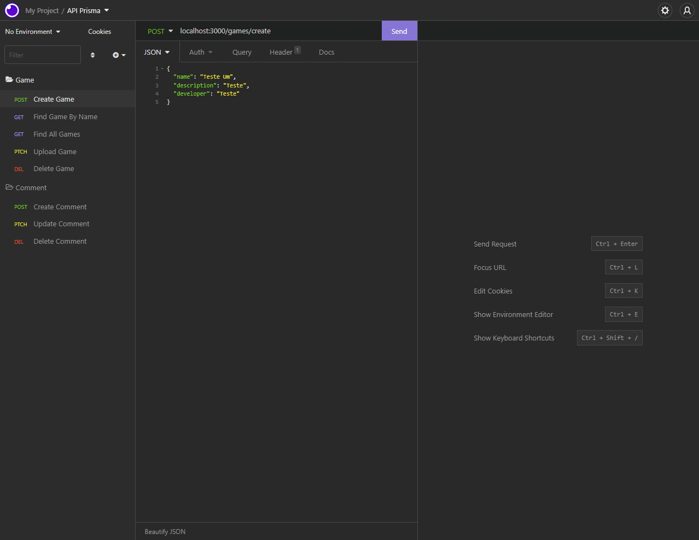

<br />
<p align="center">
    

  <h3 align="center">API Jogos e Comentários</h3>
 <br />
  <p align="center">
     Sumário
      <p align="center">
  <a href="#sobre"> Sobre </a> |
  <a href="#conhecimentos-praticados"> Conhecimentos praticados </a> |
  <a href="#rotas-da-aplicação"> Rotas da aplicação </a> |
  <a href="#tecnologias-utilizadas"> Tecnologias utilizadas </a>      
       <br />
    <br />
    <h1 align="center">
    
 </h1>
  </p>
</p>

# ✨ Sobre

O objetivo do projeto foi criar uma API de cadastro de jogos e comentários utilizando TypeScript, Node, Express, Prisma ORM, mySQL e Jest.

Nesta aplicação é possível cadastrar, listar, atualizar e deletar jogos e comentários.

# 🧪 Conhecimentos Praticados

✔ TypeScript <br>
✔ NodeJs <br>
✔ Express <br>
✔ mySQL <br>
✔ Prisma ORM <br>
✔ SOLID <br>
✔ Jest e Supertest <br>
✔ Testes Unitários e Teste de Integração

# 🚦 Rotas da aplicação:

## 🎮 Jogos

<b>[GET] </b> /games - A rota deve exibir todos os jogos cadastrados.<br>

<b>[GET] </b> /games/:name - A rota deve listar um jogo baseado em seu nome.<br>

<b>[POST] </b> /games/create - A rota deve cadastrar um jogo com as informações passadas no body da requisição.<br>

```javascript
{
"name": "Jogo Teste": string,
"description": "Descrição Teste": string,
"developer": "Desenvolvedor Teste": string
}
```

<b>[PATCH] </b> /games/update/:name - A rota deve atualizar um jogo com as informações passadas no body da requisição. Caso necessário, apenas uma informação pode ser atualizada por vez.<br>

```javascript
{
"name": "Jogo Teste": string,
"description": "Descrição Teste": string,
"developer": "Desenvolvedor Teste": string
}
```

<b>[DELETE] </b> /games/:name - A rota deve deletar um cliente baseado em seu ID.<br>

## 📄 Comentários

<b>[POST] </b> /games/:name/comment/create - A rota deve cadastrar um comentário em um jogo com as informações passadas no body da requisição.<br>

```javascript
{
"text": "comentário Teste": string,
"game_score": "Descrição Teste": number(int),
}
```

<b>[PATCH] </b> /games/comment/:id - A rota deve atualizar um comentário com as informações passadas no body da requisição baseado em seu ID. Caso necessário, apenas uma informação pode ser atualizada por vez.<br>

```javascript
{
"text": "comentário Teste": string,
"game_score": "Descrição Teste": number(int),
}
```

<b>[DELETE] </b> /games/comment/:id - A rota deve deletar um comentário baseado em seu ID.<br>

# ⚠ Dependências:

```javascript
"devDependencies": {
    "@types/express": "^4.17.13",
    "@types/jest": "^27.5.0",
    "@types/node": "^17.0.31",
    "@types/supertest": "^2.0.12",
    "cz-conventional-changelog": "^3.3.0",
    "jest": "^28.1.0",
    "prisma": "^3.14.0",
    "supertest": "^6.2.3",
    "ts-jest": "^28.0.2",
    "ts-node-dev": "^1.1.8",
    "typescript": "^4.6.4",
    "sqlite3": "^5.0.8"
  },
  "dependencies": {
    "@prisma/client": "^3.14.0",
    "dotenv": "^16.0.1",
    "express": "^4.18.1"
  }
```

# 💻 Tecnologias utilizadas:

<p align="center">
<a href="https://www.typescriptlang.org"><a href="https://nodejs.org/en/"></a> <a href="https://expressjs.com/pt-br/"></a> <a href="https://insomnia.rest/download"></a> <a href="https://www.prisma.io"></a> <a href="https://www.mysql.com"></a> <a href="https://jestjs.io/pt-BR/"></a>
</p>

---

\*\*Desenvolvido por <a href="https://www.linkedin.com/in/bruno-andreotti/"> Bruno Andreotti</a>
